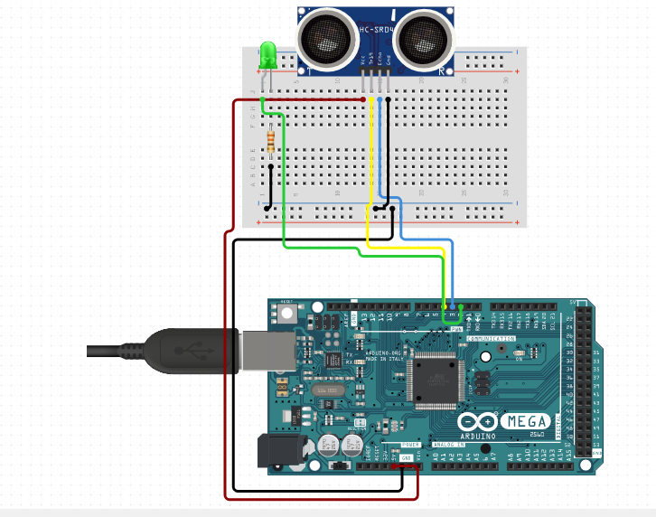

#### THIS PROGRAM USES [GPL V3 LICENSE](../../LICENSE)

# automatic door light
it's a project by which LED turns on if Ultrasonic Sensor detects distance more than 20 cm.  

#### requienments
arduino board  
ultrasonic sensor (HC-SR04)  
led  
jumper wires  

#### how to run?
put code in your arduino IDE.  
compile, upload, enjoy!

#### circuit

#### contributors
by [@JymPatel](https://github.com/JymPatel)  
